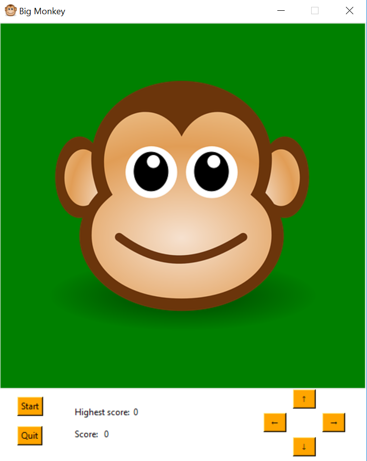
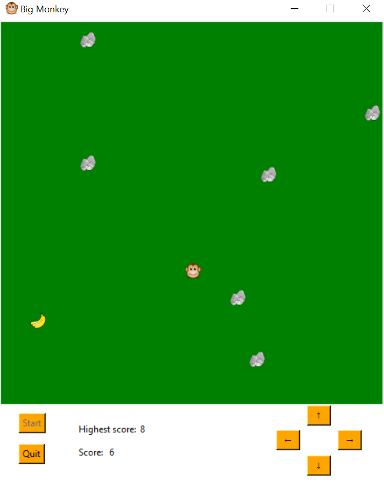

# MovingMonkey
A minigame with Python built-in library

  In this game, a monkey is looking for bananas, which randomly appear on the map. Every time a banana is collected, one point is awarded. Meanwhile, a stone will be dropped on the map randomly. The game ends when the monkey hits either the edge or the stone. Press "Enter" or the soft key "Start" to start the game.You can control the monkey using both the keyboard or the soft key. Pressing "Enter" also enables restart of the game.
  

